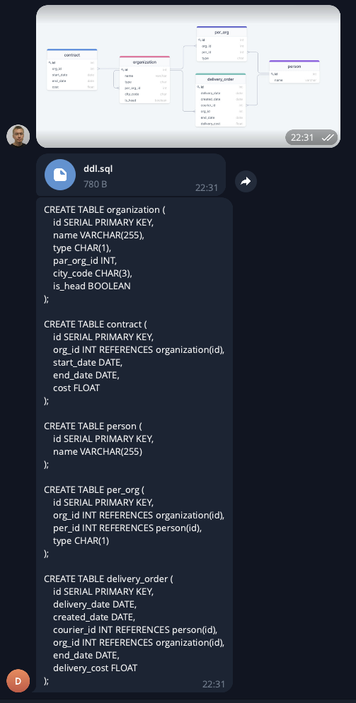
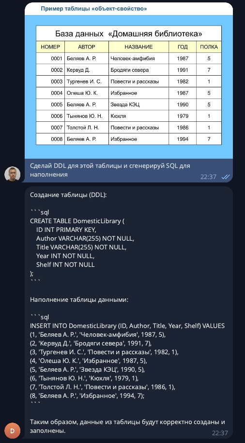
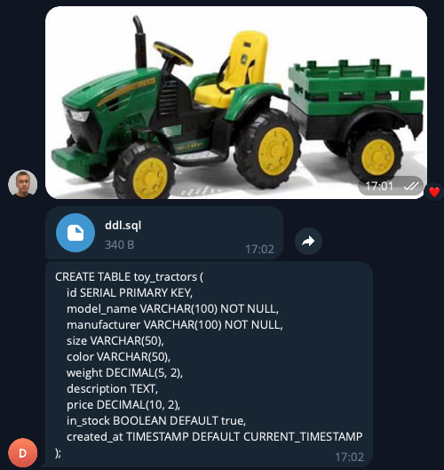

# Data Team Assist Bot
https://t.me/data_team_assist_bot

# А что умеет? 
- Можешь задать ему вопрос текстом
- Кинуть картинку и попросить пояснить за происходящее на ней
- Можешь отправить ему картинку из какой-нибудь презы с таблицей или скриншот с ERD для которой лень генерить DDL. Например, можешь сделать скрин таблицы ниже и просто отправить скрин боту

# Вот несколько скриншотов с примерами работы:

# Дашик любо дорого посмотреть
https://datalens.yandex/k38rstuhcdrk8

Каждый запрос пользователей к боту логируется в таблицу PG. Реализовано это для решения следующих вопросов:
1) Считать показатели продукта (DAU\WAU\MAU)
2) Смотреть на нагрузку по дням \ часам
3) И самое вкусное. Читать чем интересуются люди и использовать эти данные ~~во благо человечества~~ для рекламы и спамить их в ответ. но это всё как-нибудь потом запилится

# Как проднять у себя ? 
1) Форкаем проект
2) Идём в Settings -> Secrets and variables и создаем:

| Тип      | КОД              | Описание
|----------|------------------|---|
| Secret   | OPENAI_API_KEY  | API ключ от OpenAI
| Secret   | TELEGRAM_BOT_TOKEN  | API ключ от Telegram
| Secret   | REMOTE_SERVER_ADDRESS  | Адрес сервера где разворачиваем бота
| Secret   | REMOTE_SERVER_PORT  | Порт сервера где разворачиваем бота
| Secret   | REMOTE_SERVER_USERNAME  | Логин от сервера где разворачиваем бота
| Secret   | REMOTE_SERVER_PASSWORD  | Пароль для сервера где разворачиваем бота
| Secret   | DOCKERHUB_TOKEN  | Пароль от репы с образами
| Variable | DOCKERHUB_USERNAME  | Пользователь для репы с образами
| Variable | DOCKERHUB_REPO  | Имя репозитория образов
| Variable | DOCKERHUB_TAG  | Тег образа

См. файл .github/workflows/main-push.yml

3) Мёрджим \ пушим изменения в main ветку 
4) Идём тыкать палкой своего бота в ТГ